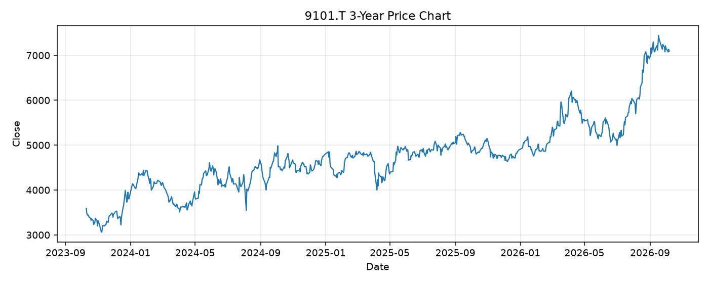

# 9101.T レポート

> このページの目的: 単一銘柄のファンダメンタル・価格推移・ニュースを確認し、候補採用可否を判断する。

- 最終更新: 2026-10-07 20:52:31 JST
- 実行ID: 2026-10-07-205231

## 基本情報

- **longName**: Nippon Yusen Kabushiki Kaisha
- **symbol**: 9101.T
- **sector**: Industrials
- **industry**: Marine Shipping
- **country**: Japan
- **marketCap**: 2862020034560

## 株価チャート（3年）

## 主要指標

- [指標の見方ヘルプ](../../../../indicators.md)

| 指標 | 値 |
|---|---:|
| PER | 14.40 |
| 配当利回り | 336.00% |
| PBR | 0.92 |
| ROE | 7.70% |
| Debt/Equity | 42.80 |
| 売上成長率 | 21.10% |
| Beta | 0.72 |

## yfinance ニュース

- ニュースが取得できませんでした。

## NewsAPI ニュース

- NewsAPI でニュースが取得されませんでした。
