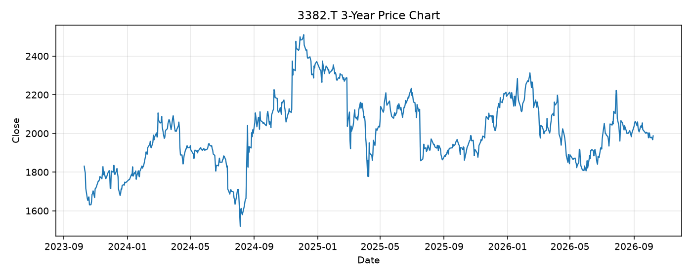

# 3382.T レポート

> このページの目的: 単一銘柄のファンダメンタル・価格推移・ニュースを確認し、候補採用可否を判断する。

- 最終更新: 2026-10-08 20:49:28 JST
- 実行ID: 2026-10-08-204928

## 基本情報

- **longName**: Seven & i Holdings Co., Ltd.
- **symbol**: 3382.T
- **sector**: Consumer Defensive
- **industry**: Grocery Stores
- **country**: Japan
- **marketCap**: 4505779306496

## 株価チャート（3年）

## 主要指標

- [指標の見方ヘルプ](../../../../indicators.md)

| 指標 | 値 |
|---|---:|
| PER | 16.56 |
| 配当利回り | 305.00% |
| PBR | 1.25 |
| ROE | 8.05% |
| Debt/Equity | 104.36 |
| 売上成長率 | -14.70% |
| Beta | 0.11 |

## yfinance ニュース

- ニュースが取得できませんでした。

## NewsAPI ニュース

- NewsAPI でニュースが取得されませんでした。
