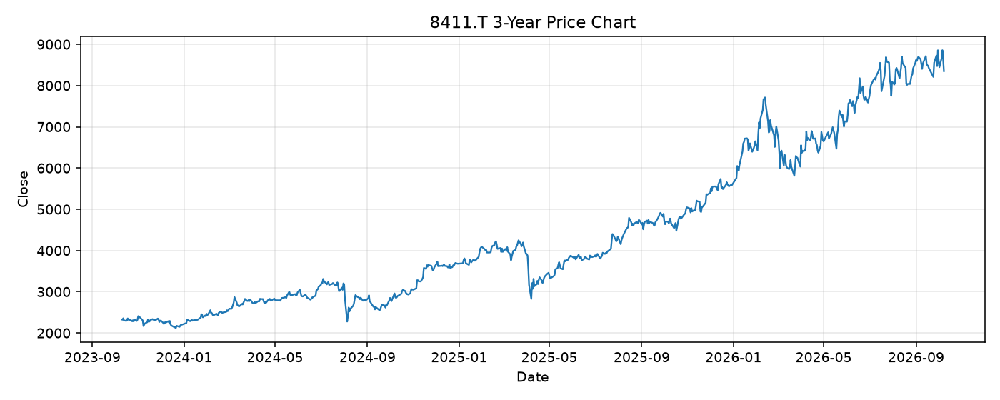

# 8411.T レポート

> このページの目的: 単一銘柄のファンダメンタル・価格推移・ニュースを確認し、候補採用可否を判断する。

- 最終更新: 2026-10-08 20:52:35 JST
- 実行ID: 2026-10-08-205235

## 基本情報

- **longName**: Mizuho Financial Group, Inc.
- **symbol**: 8411.T
- **sector**: Financial Services
- **industry**: Banks - Regional
- **country**: Japan
- **marketCap**: 20212074151936

## 株価チャート（3年）

## 主要指標

- [指標の見方ヘルプ](../../../../indicators.md)

| 指標 | 値 |
|---|---:|
| PER | 15.42 |
| 配当利回り | 174.00% |
| PBR | 1.77 |
| ROE | 12.49% |
| Debt/Equity | - |
| 売上成長率 | 35.00% |
| Beta | 0.39 |

## yfinance ニュース

- ニュースが取得できませんでした。

## NewsAPI ニュース

- NewsAPI でニュースが取得されませんでした。
