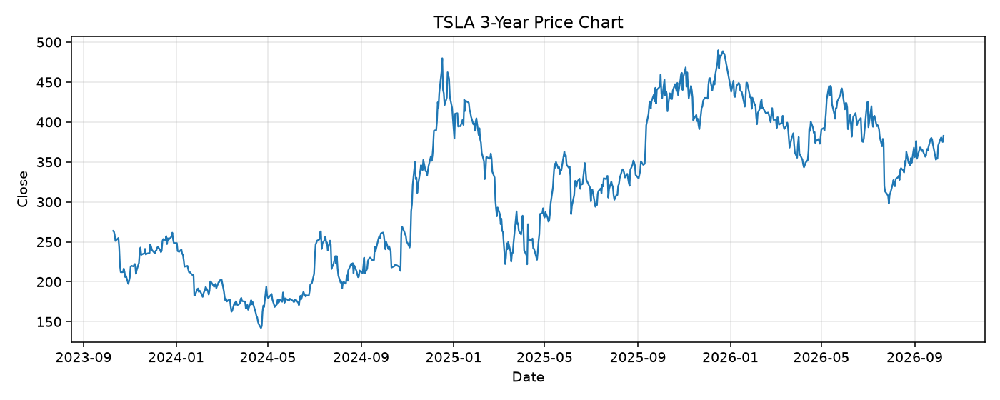

# TSLA レポート

> このページの目的: 単一銘柄のファンダメンタル・価格推移・ニュースを確認し、候補採用可否を判断する。

- 最終更新: 2026-10-09 20:19:55 JST
- 実行ID: 2026-10-09-201955

## 基本情報

- **longName**: Tesla, Inc.
- **symbol**: TSLA
- **sector**: Consumer Cyclical
- **industry**: Auto Manufacturers
- **country**: United States
- **marketCap**: 1511491895296

## 株価チャート（3年）

## 主要指標

- [指標の見方ヘルプ](../../../../indicators.md)

| 指標 | 値 |
|---|---:|
| PER | 354.35 |
| 配当利回り | 0.00% |
| PBR | 17.40 |
| ROE | 4.67% |
| Debt/Equity | 18.37 |
| 売上成長率 | 25.50% |
| Beta | 1.92 |

## yfinance ニュース

- ニュースが取得できませんでした。

## NewsAPI ニュース

- NewsAPI でニュースが取得されませんでした。
