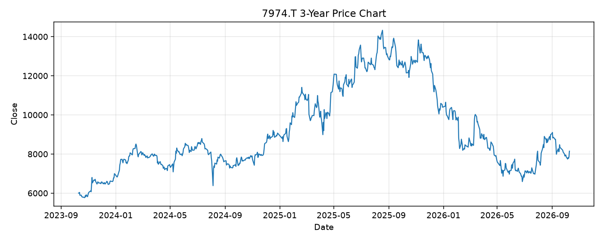

# 7974.T レポート

> このページの目的: 単一銘柄のファンダメンタル・価格推移・ニュースを確認し、候補採用可否を判断する。

- 最終更新: 2026-10-09 20:22:50 JST
- 実行ID: 2026-10-09-202250

## 基本情報

- **longName**: Nintendo Co., Ltd.
- **symbol**: 7974.T
- **sector**: Communication Services
- **industry**: Electronic Gaming & Multimedia
- **country**: Japan
- **marketCap**: 9391305654272

## 株価チャート（3年）

## 主要指標

- [指標の見方ヘルプ](../../../../indicators.md)

| 指標 | 値 |
|---|---:|
| PER | 19.17 |
| 配当利回り | 279.00% |
| PBR | 3.22 |
| ROE | - |
| Debt/Equity | - |
| 売上成長率 | -9.50% |
| Beta | - |

## yfinance ニュース

- ニュースが取得できませんでした。

## NewsAPI ニュース

- NewsAPI でニュースが取得されませんでした。
