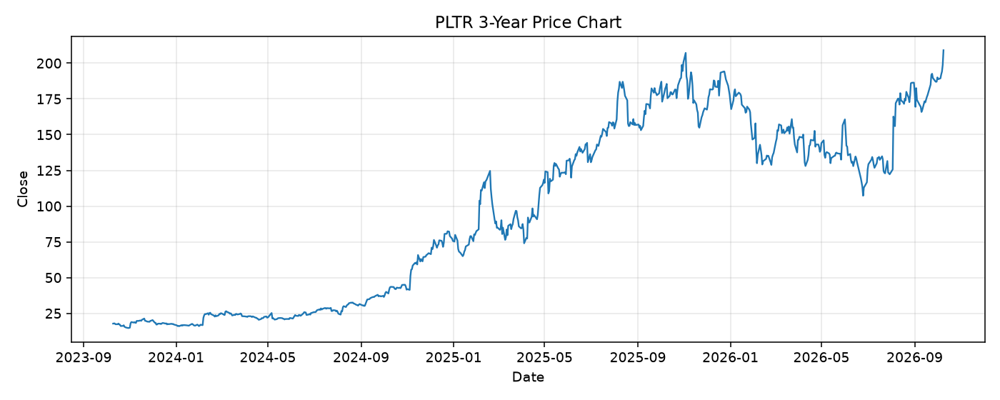

# PLTR レポート

> このページの目的: 単一銘柄のファンダメンタル・価格推移・ニュースを確認し、候補採用可否を判断する。

- 最終更新: 2026-10-09 20:22:50 JST
- 実行ID: 2026-10-09-202250

## 基本情報

- **longName**: Palantir Technologies Inc.
- **symbol**: PLTR
- **sector**: Technology
- **industry**: Software - Infrastructure
- **country**: United States
- **marketCap**: 502359359488

## 株価チャート（3年）

## 主要指標

- [指標の見方ヘルプ](../../../../indicators.md)

| 指標 | 値 |
|---|---:|
| PER | 180.22 |
| 配当利回り | 0.00% |
| PBR | 51.39 |
| ROE | 38.10% |
| Debt/Equity | 2.14 |
| 売上成長率 | 92.80% |
| Beta | 1.60 |

## yfinance ニュース

- ニュースが取得できませんでした。

## NewsAPI ニュース

- NewsAPI でニュースが取得されませんでした。
