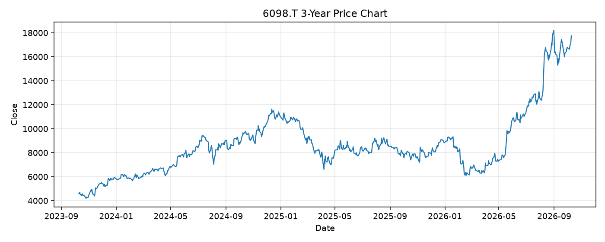

# 6098.T レポート

> このページの目的: 単一銘柄のファンダメンタル・価格推移・ニュースを確認し、候補採用可否を判断する。

- 最終更新: 2026-10-10 19:31:46 JST
- 実行ID: 2026-10-10-193146

## 基本情報

- **longName**: Recruit Holdings Co., Ltd.
- **symbol**: 6098.T
- **sector**: Communication Services
- **industry**: Internet Content & Information
- **country**: Japan
- **marketCap**: 24659380666368

## 株価チャート（3年）

## 主要指標

- [指標の見方ヘルプ](../../../../indicators.md)

| 指標 | 値 |
|---|---:|
| PER | 43.42 |
| 配当利回り | 15.00% |
| PBR | 13.93 |
| ROE | 36.22% |
| Debt/Equity | 10.00 |
| 売上成長率 | 18.90% |
| Beta | 0.99 |

## yfinance ニュース

- ニュースが取得できませんでした。

## NewsAPI ニュース

- NewsAPI でニュースが取得されませんでした。
