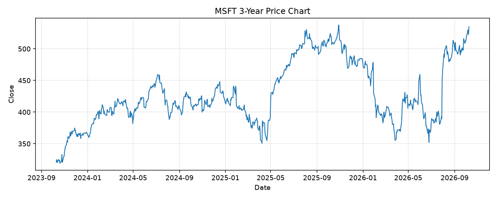

# MSFT レポート

> このページの目的: 単一銘柄のファンダメンタル・価格推移・ニュースを確認し、候補採用可否を判断する。

- 最終更新: 2026-10-10 19:31:46 JST
- 実行ID: 2026-10-10-193146

## 基本情報

- **longName**: Microsoft Corporation
- **symbol**: MSFT
- **sector**: Technology
- **industry**: Software - Infrastructure
- **country**: United States
- **marketCap**: 3973186846720

## 株価チャート（3年）

## 主要指標

- [指標の見方ヘルプ](../../../../indicators.md)

| 指標 | 値 |
|---|---:|
| PER | 29.81 |
| 配当利回り | 75.00% |
| PBR | 8.98 |
| ROE | 34.04% |
| Debt/Equity | 29.12 |
| 売上成長率 | 17.70% |
| Beta | 1.10 |

## yfinance ニュース

- ニュースが取得できませんでした。

## NewsAPI ニュース

- NewsAPI でニュースが取得されませんでした。
