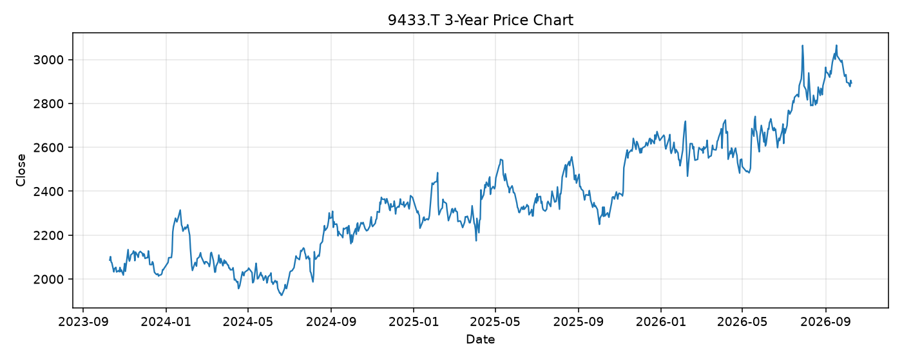

# 9433.T レポート

> このページの目的: 単一銘柄のファンダメンタル・価格推移・ニュースを確認し、候補採用可否を判断する。

- 最終更新: 2026-10-10 19:33:50 JST
- 実行ID: 2026-10-10-193350

## 基本情報

- **longName**: KDDI Corporation
- **symbol**: 9433.T
- **sector**: Communication Services
- **industry**: Telecom Services
- **country**: Japan
- **marketCap**: 10690172551168

## 株価チャート（3年）

## 主要指標

- [指標の見方ヘルプ](../../../../indicators.md)

| 指標 | 値 |
|---|---:|
| PER | 14.86 |
| 配当利回り | 290.00% |
| PBR | 2.15 |
| ROE | 14.59% |
| Debt/Equity | 93.80 |
| 売上成長率 | 3.60% |
| Beta | -0.07 |

## yfinance ニュース

- ニュースが取得できませんでした。

## NewsAPI ニュース

- NewsAPI でニュースが取得されませんでした。
