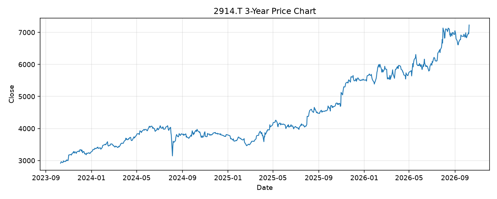

# 2914.T レポート

> このページの目的: 単一銘柄のファンダメンタル・価格推移・ニュースを確認し、候補採用可否を判断する。

- 最終更新: 2026-10-10 19:35:56 JST
- 実行ID: 2026-10-10-193556

## 基本情報

- **longName**: Japan Tobacco Inc.
- **symbol**: 2914.T
- **sector**: Consumer Defensive
- **industry**: Tobacco
- **country**: Japan
- **marketCap**: 12835834822656

## 株価チャート（3年）

## 主要指標

- [指標の見方ヘルプ](../../../../indicators.md)

| 指標 | 値 |
|---|---:|
| PER | 21.01 |
| 配当利回り | 376.00% |
| PBR | 2.92 |
| ROE | 14.30% |
| Debt/Equity | 37.91 |
| 売上成長率 | 17.00% |
| Beta | 0.15 |

## yfinance ニュース

- ニュースが取得できませんでした。

## NewsAPI ニュース

- NewsAPI でニュースが取得されませんでした。
