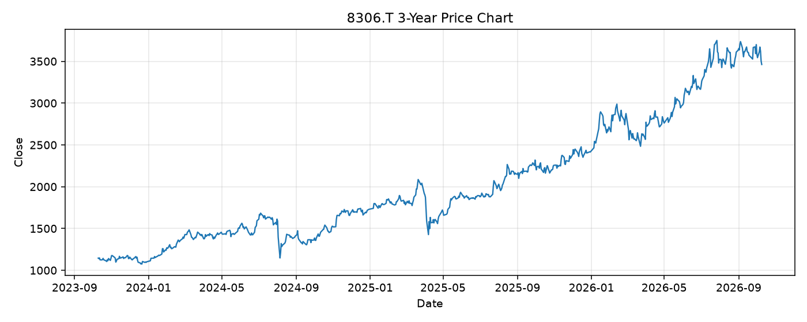

# 8306.T レポート

> このページの目的: 単一銘柄のファンダメンタル・価格推移・ニュースを確認し、候補採用可否を判断する。

- 最終更新: 2026-10-10 19:35:56 JST
- 実行ID: 2026-10-10-193556

## 基本情報

- **longName**: Mitsubishi UFJ Financial Group, Inc.
- **symbol**: 8306.T
- **sector**: Financial Services
- **industry**: Banks - Diversified
- **country**: Japan
- **marketCap**: 38967458136064

## 株価チャート（3年）

## 主要指標

- [指標の見方ヘルプ](../../../../indicators.md)

| 指標 | 値 |
|---|---:|
| PER | 14.64 |
| 配当利回り | 277.00% |
| PBR | 1.72 |
| ROE | 9.46% |
| Debt/Equity | - |
| 売上成長率 | 28.80% |
| Beta | 0.35 |

## yfinance ニュース

- ニュースが取得できませんでした。

## NewsAPI ニュース

- NewsAPI でニュースが取得されませんでした。
