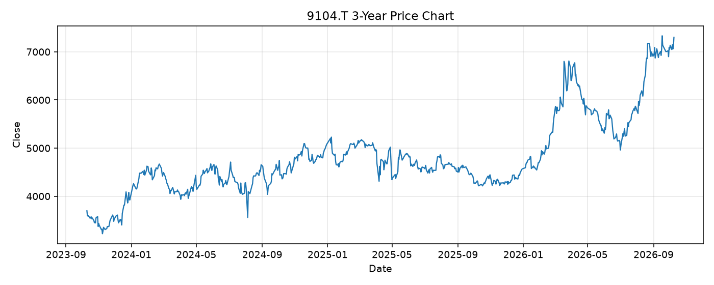

# 9104.T レポート

> このページの目的: 単一銘柄のファンダメンタル・価格推移・ニュースを確認し、候補採用可否を判断する。

- 最終更新: 2026-10-10 19:35:56 JST
- 実行ID: 2026-10-10-193556

## 基本情報

- **longName**: Mitsui O.S.K. Lines, Ltd.
- **symbol**: 9104.T
- **sector**: Industrials
- **industry**: Marine Shipping
- **country**: Japan
- **marketCap**: 2508770770944

## 株価チャート（3年）

## 主要指標

- [指標の見方ヘルプ](../../../../indicators.md)

| 指標 | 値 |
|---|---:|
| PER | 11.34 |
| 配当利回り | 294.00% |
| PBR | 0.84 |
| ROE | 7.89% |
| Debt/Equity | 85.57 |
| 売上成長率 | 68.90% |
| Beta | 0.66 |

## yfinance ニュース

- ニュースが取得できませんでした。

## NewsAPI ニュース

- NewsAPI でニュースが取得されませんでした。
