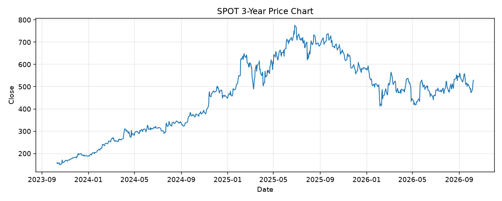

# SPOT レポート

> このページの目的: 単一銘柄のファンダメンタル・価格推移・ニュースを確認し、候補採用可否を判断する。

- 最終更新: 2026-10-10 19:35:56 JST
- 実行ID: 2026-10-10-193556

## 基本情報

- **longName**: Spotify Technology S.A.
- **symbol**: SPOT
- **sector**: Communication Services
- **industry**: Internet Content & Information
- **country**: Sweden
- **marketCap**: 108782829568

## 株価チャート（3年）

## 主要指標

- [指標の見方ヘルプ](../../../../indicators.md)

| 指標 | 値 |
|---|---:|
| PER | 30.41 |
| 配当利回り | 0.00% |
| PBR | 11.39 |
| ROE | 44.48% |
| Debt/Equity | 5.56 |
| 売上成長率 | 13.90% |
| Beta | 1.61 |

## yfinance ニュース

- ニュースが取得できませんでした。

## NewsAPI ニュース

- NewsAPI でニュースが取得されませんでした。
